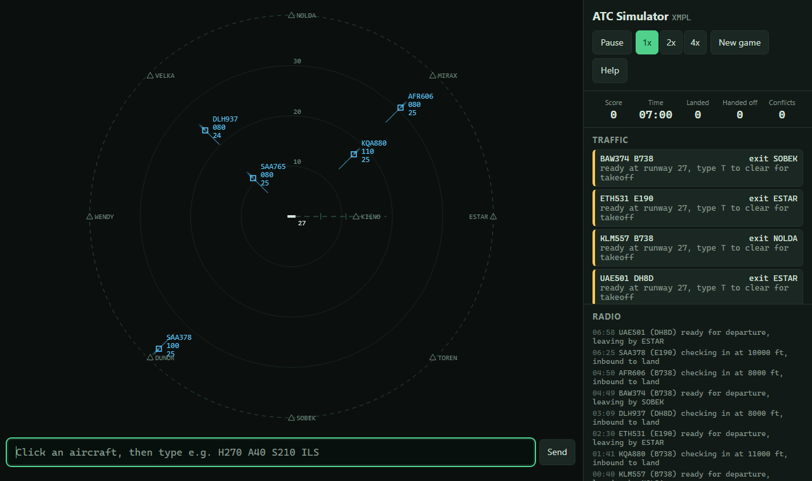

# ATC Simulator

A radar air traffic control game that runs in the browser. You control the
airspace round a made-up airport: vector arrivals onto the approach to land,
clear departures for takeoff and send them out by their exit point, and keep
every aircraft 3 nm or 1000 ft from every other.

**Play it:** https://rs-r06.github.io/ATC-Simulator/

**How this was built:** I wrote this with Claude, Anthropic's AI assistant,
as a learning project. Claude wrote the first version of the code, tests and
this README.



## Who it is for

Anyone curious about what a radar controller does, and students who want to
see a small real-time simulation in plain JavaScript, with no framework and
no build step.

## How to run it

The game uses JavaScript modules, which browsers will not load straight from
a file, so serve the folder:

```bash
python -m http.server 8080
```

Then open http://localhost:8080. Any static web server works, as does
GitHub Pages.

To run the tests (Node 18 or later, nothing to install):

```bash
npm test
```

## How to play

Click an aircraft, type an instruction and press Enter. You can chain several:

| Command | Meaning |
|---|---|
| `H270` | fly heading 270 |
| `L090` / `R090` | turn left or right onto heading 090 |
| `A40` | climb or descend to 4000 ft |
| `S210` | fly at 210 knots |
| `D KILNO` | fly direct to the fix KILNO |
| `ILS` | cleared for the approach to runway 27 |
| `T` | cleared for takeoff |

The easy way to land an arrival is `D KILNO A30 ILS`: it flies to KILNO,
turns onto the final approach and comes down the glide slope by itself.
Departures must leave the sector within 10 nm of their exit fix and above
5000 ft.

| Event | Points |
|---|---|
| Arrival lands | +10 |
| Departure handed off at its fix | +10 |
| Departure leaves off route or too low | -5 |
| Go-around (too high or fast on final) | -5 |
| Arrival leaves the sector | -10 |
| Loss of separation | -20 |

Traffic gets busier as the game goes on. Add `?seed=42` to the address to
replay the same traffic.

## What I built

- `src/aircraft.js`: flight model. Standard rate turns of 3 degrees a second,
  climb and descent rates for four aircraft types, speed changes, direct to a
  fix, and an automatic ILS approach that turns onto the centre line and
  follows a 3 degree glide slope.
- `src/commands.js`: turns typed text into instructions, and explains what
  went wrong when it cannot.
- `src/simulation.js`: the game. Spawns traffic from a seeded random number
  generator, checks every instruction before applying any of it, detects loss
  of separation, lands or sends round aircraft on final, and keeps the score.
- `src/radar.js`: draws the radar picture on a canvas: range rings, the
  runway and approach, fixes, and each aircraft with its trail, one minute
  heading line and data block.
- `src/main.js`: the page. The game clock runs on its own timer, apart from
  drawing, so game time keeps pace even when the browser draws fewer frames.
- 23 tests with Node's built-in test runner. They fly aircraft through turns,
  climbs, landings from both sides of the airport, go-arounds, takeoffs,
  hand-offs and conflicts, and check that the same seed gives the same game.

The simulation code never touches the page, which is what lets the tests run
it in Node.

## Simplifications

This is a game, not a training tool. There is no wind, one runway, one
airport, and no tower: aircraft below 1000 ft are left out of separation
checks. Performance figures are rough. The airport and fix names are made up.

## What I learned

[FILL IN: two or three sentences in your own words, once you have played it
and read through the code. For example: why the simulation keeps its own
clock, how the localizer capture decides when to start the turn, or why
every command is checked before any part of it is applied.]

## Author

Rehumile Sechele, rehumiles@gmail.com
